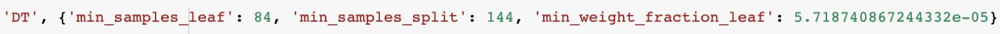
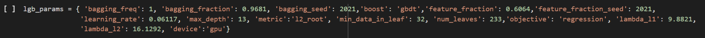
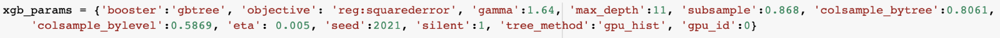

# Price Prediction of Used Cars

Team No: 14 | Weipeng Zhang | Aravindh Gowtham Bommisetty | Sai Vineeth Kaza

*Code Author: Weipeng Zhang*

- The notebook named `US Used Car Price Prediciton.ipynb` contains the full version of our code. Running the cells in order will do all the operations we did that were presented in our final presentation and report.

- To just to reproduce our experiment results, please run the notebook named `Demo.ipynb`. The result may be a little different because the LGB and XGB models were trained on GPU, but the difference of the final RMSE between the running result and our report should be less than 0.2/2854.

- Considering the size of data and model, we suggest to use high-RAM with GPU runtime in Google Colab.

Abstract
--------

 Our objective is to predict the price of a car given certain characteristics of it. The dataset used contains information about the cars in United States. After preprocessing the data which includes identifying features to drop based on proportion of missing values and the value it would add to the final model, imputing the data, adding new columns through feature engineering, we have evaluated the performance of several regression models such as Linear regression, Lasso Regression, Ridge Regression, Decision Tree Regressor, Light GBM Regressor, XGBoost Regressor and ensemble models. XGBoost Regressor and ensemble model has come out to be the best performing models among all of them, where RMSE has been chosen as the evaluation criteria.

Introduction
------------

There are millions of used cars being sold every year in the United States and there is abundant information regarding the details of used cars that are being sold. Predicting used cars’ market value can help both buyers and sellers in several ways. This can be made possible by correctly leveraging this data using prediction models such as regression models. Through these models, sellers can get a better idea of what makes a car desirable and offer a better service. There are online pricing websites that offer an estimated value of a car. Though they already have a model, having an alternate model might help them give a better pricing prediction. This model will help the individuals to get a better understanding of the used cars’ market and save a good amount of money. Selecting relevant features which will make for a good model is a tricky and challenging aspect we are looking forward to tackling.

Feature Extraction and Preprocessing
------------------------------------

The Dataset provided details like Vehicle Identification Number, Front Legroom, Back Legroom, Price, City, Zip Code etc. for about 3 million real-world used cars. It is derived from Kaggle: [US Used Cars Dataset](https://www.google.com/url?q=https://www.kaggle.com/ananaymital/us-used-cars-dataset&sa=D&source=editors&ust=1643560893203993&usg=AOvVaw0cXtGz7GDWyRpZekBVORTa). The dataset consists of 3000040 records and 66 columns. Out of the 66 columns, (27 numerical features, 11 Boolean features, 24 categorical features and 4 other features) that are used to predict the price of used cars.

*Fig. 1. List of the key features of the dataset used to predict the price of the car*

*Fig. 2. Description of some of the key features of the dataset*

### Exploratory Data Analysis

Exploratory Data Analysis (EDA) is an approach used to analyze the data set mostly using graphical representations or summary statistics to make sense of the data, discover underlying patterns, spot anomalies and test the hypothesis. We performed Exploratory Data Analysis to understand the distribution of the data and obtain the correlation between the key features and the target variable (‘price’) as shown in Fig. 3.

*Fig. 3. Correlation plot of the key features and target variable (‘price’)*

*Fig. 4. Density plot of the target variable (‘price’)*

Fig. 4. shows the distribution plot of the ‘price’ variable, which is the target variable in our case. The distribution of the ‘price’ variable is right skewed with the exotic cars costing over 3M.

*Fig. 5. Density plot of the ‘horsepower’ variable*

Fig. 5. shows the distribution plot of the ‘horsepower’ variable, one of the important specifications of a car. The horsepower variable ranges from 80 to 1001, the highest value corresponding to Bugatti Veyron.

*Fig. 6. Bar plot of the ‘transmission’ and ‘fuel\_type’ variables*

Fig. 6. shows the bar plot of the ‘transmission’ variable and the ‘fuel\_type’ variable. According to Fig. 6, as the data is collected in US, Automatic transmission is the most used transmission in the cars and Gasoline is the most used fuel type for the cars. 

We started by cleaning the data (finding the variables with NA values, imputing the NA variables and dropping variables that are not useful for the model. After cleaning the data, we implemented proposed modelling techniques to predict the price of the used cars. 

### Data Pre-processing

As the dataset is about used cars, and the task is to predict the price of these used cars, it consisted of 16 variables which has NA values percentage as high as 45%. There are 20 variables which are not useful for the final model. There are 2 variables which consisted of duplicate information. We used stratified K-fold to split data according to the target variable (‘price’) distribution. 

The following steps are incorporated to perform data preprocessing:

1.  Out of the 16 variables with NA values, 9 variables are dropped, and 7 variables were imputed accordingly.
2.  As mentioned above, 20 variables which are not useful for the model were dropped.
3.  As mentioned above, 2 variables with duplicate information were dropped.
4.  There were columns with object data type and were transformed into their respective data type.
5.  There were units of measurement present in the variables and were removed from the data.
6.  Continuous variables were imputed with mean and categorical variables are imputed with mode.
7.  We reduced the memory usage of the dataset by transforming the data type of the variables, as per the data present in the variables (For example, a variable consisted of float 16 values but is taken as Float 32, we changed the data type to float 16). The memory usage has been reduced by 33% (640 MB to 430 MB).
8.  We label encoded the required columns, so that they can be fed into the LightGBM model.
9.  We one-hot encoded the categorical variables to feed into the models.
10.  We used stratified K-fold to create 22 bins according to the target variable (‘price) distribution. Then we divide the data in each bin into 5 splits to split the valid set during cross validation and the test set.

### Feature Engineering

We implemented feature engineering in 3 different methods, i) by using group by operations on the variables, such as ‘mean milage of each type of fuel’ ii) by using target encoding on categorical variables, such as ‘mean price of each model’, iii) other useful features from the existing variables, such as ‘estimated fuel spent in city’. We finally generated 43 new features to feed into the models.

## Models, Experiments and Evaluation

The models which were used to build the final predictive model:

*   Linear Regression.
*   Ridge Regression.
*   Lasso Regression.
*   Decision Tree Regressor.
*   Light Gradient Boosting Machine Regressor (LGBM).
*   Extreme Gradient Boosting Machine Regressor (XGBoost).
*   Ensemble Modeling.

 Initially, we implemented the above-mentioned models individually on the test – train split obtained after splitting the data in a stratified manner. For each model, Bayesian optimization techniques were used to find optimal hyperparameters. Later, some of the final models were used to create a better ensemble model and the weights of each constituent model were found via ridge regression. Evaluation of all the final models were reported on the test dataset at the end of Data cleaning, Feature Engineering and hyperparameter tuning and the best model was reported after comparative analysis of all the models. 

### Linear, Lasso & Ridge Regression

Linear regression is the most widely used model for predictive modeling. We implemented a linear regression with the target variable (Y) as the ‘price’ and the remaining features as the independent variables (X). The model is of the form: 

Performance of Linear regression on test dataset is as follows: Root Mean Square Error (RMSE) = 4179.112239, Mean Squared Error (MSE) = 17464980 and Mean Absolute Error (MAE) = 2938.365156. We regularized the linear regression model by adding the norms L-1 norm (Lasso regression) and L-2 norm (Ridge regression) to the cost function. The cost functions of the Lasso and Ridge regression are of the form respectively:

 

Performance of Lasso regression on test dataset is as follows: Root Mean Square Error (RMSE) = 4180.510277, Mean Squared Error (MSE) = 17476670 and Mean Absolute Error (MAE) = 2938.706503. Performance of Ridge regression is as follows: Root Mean Square Error (RMSE) = 4179.112242, Mean Squared Error (MSE) = 17464980 and Mean Absolute Error (MAE) = 2938.363303. Among the above three models, Ridge regression gave the best results.

### Decision Tree Regressor

Decision tree regressor builds regression model in the form of a tree structure. It breaks down a dataset into smaller and smaller subsets while at the same time an associated decision tree is incrementally developed and finally a continuous output is predicted. The hyper parameters resulted from Bayesian Optimization are as follows: 

 

*   min\_samples\_leaf: The minimum number of samples required to be at a leaf node. 
*   min\_samples\_split: The minimum number of samples required to split an internal node. 
*   min\_weight\_fraction\_leaf: The minimum weighted fraction of the sum total of weights (of all the input samples) required to be at a leaf node. 

Performance of Decision Tree Regressor on test dataset is as follows: Root Mean Square Error (RMSE) = 3050.55, Mean Squared Error (MSE) = 9.32E+06 and Mean Absolute Error (MAE) = 2144.10.

### Light Gradient Boosting Machine Regressor (LGBM)

Light Gradient Boosting Machine is an efficient and effective implementation of the gradient boosting framework based mainly on the decision tress algorithm. LGBM adds automatic feature selection and focusing on boosting samples with larger gradients to the existing boosting framework. This method results in faster training, higher efficient predicting with better accuracy, lower memory usage, better accuracy, supports parallel, GPU and distributed learning and handles large scale data with ease. LGBM uses leaf-wise tree growth algorithm unlike other tools which use depth-wise tree growth algorithm which results in faster convergence. Parameter tuning is a key aspect of LGBM, and the following parameters are used in our implementation:

-----------------------

- `bagging_freq` - Set to a non-zero value to enable bagging.

- `bagging_fraction` - Bagging_fraction value ranges from 0 to 1. To enable bagging, set it less than 1.

- `boost` - set to default value gbdt (gradient boosting decision tree).

- `feature_fraction` - LGBM randomly selects a subset of features on each tree. Ranges from 0 to 1.

- `learning_rate` - shrinkage rate. Default value is 0.1.

- `max_depth` - denotes the max depth for the tree.

- `metric` - metrics to be evaluated on the evaluation set.

- `min_data_in_leaf` - minimum number of data in one leaf.

- `num_leaves` - maximum number of leaves in one tree

- `objective` - regression application, set to default as regression.

- `lambda_l1` - L-1 regularization, default value is set to 0.

- `lambda_l2` - L-2 regularization, default value is set to 0.

- `device` - device for tree learning, GPU is used for faster learning.

Performance of the Light gradient boosting machine regressor (LGBM) is as follows: Root Mean Square Error (RMSE) = 2990.714435, Mean Squared Error (MSE) = 8.94E+06 and Mean Absolute Error (MAE) = 2129.761951.

### Extreme Gradient Boosting Model (XGBOOST)

XGBOOST is an improved version of the Gradient Boosting Algorithm. It does not build the full tree structure but builds it greedily. As compared to LightGBM, it splits level-wise rather than leaf-wise. In Gradient Boosting, negative gradients are considered to optimize the loss function but here Taylor’s expansion is considered. Optimal Parameters resulted from Bayesian Optimization algorithm are as follows: 

 

*   `booster` - Booster is the model of XBGoost, that contains low level routines for training, prediction and evaluation. 
*   `objective` - Specify the learning task and it’s learning objective or a custom objective function to be used  
*   `gamma` - Minimum loss reduction required to make a further partition on a leaf node of the tree. 
*   `max_depth` - Maximum tree depth for base learners. 
*   `subsample` - Subsample ratio of the training instance. 
*   `colsample_bytree` - Subsample ratio of columns when constructing each tree. 
*   `colsample_bylevel` - Subsample ratio of columns for each level. 
*   `eta` – Boosting Learning Rate 
*   `tree_method` - Specify which tree method to use. 

Performance of Linear regression on test dataset is as follows: Root Mean Square Error (RMSE) = 3052.64, Mean Squared Error (MSE) = 9.32E+06 and Mean Absolute Error (MAE) = 2144.10 

### Ensemble Modeling

Ensemble Modeling is an approach used to implement multiple diverse base models to predict an outcome, either by using different modeling algorithms or by using different data sets for training. Ensemble model then aggregates the predictions and the results of each base model to predict the final value for the given data. The main use of using ensemble modeling is to reduce generalization error of the prediction. Ensemble model acts as a single model even though it contains many different base models.

Finally, to utilize all the knowledge that different models had learned, we combined all the models mentioned before together by using a ridge regressor to learn the combining weights of different models. Firstly, we concatenated the prediction of the valid set during the cross-validation training part as the prediction of the train set from the model. We used the predicting result from 6 different models as the input features to train the ridge regressor and got our final prediction of the test set. Implementation of the ensemble modeling is explained in Fig. 7.

*Fig. 7. Flow of the Ensemble Modeling Implementation*

Performance of the Ensemble Modeling technique is as follows: Root Mean Square Error (RMSE) = 2854.089, Mean Squared Error (MSE) = 8.15E+06 and Mean Absolute Error (MAE) = 2010.643.

Results
-------

We have performed data cleaning, feature engineering on the data and hyperparameter tuning for every model. Table 1 summarizes the performance (RMSE) of each model on the test data after each stage in the whole process. XGBoost Regressor is the best model after hyperparameter tuning with RMSE = 2854.211, while linear models Ridge, and Lasso performed the worst. Table 2 consists of values of three evaluation metrics RMSE, MSE and MAE of all the six models after hyperparameter tuning and the ensemble model of all the six models whose ensemble weights were decided through ridge regression. Ensemble model has slightly bettered the performance of XGBoost model with an RMSE = 2854.088.

| **Model**               | **Baseline**    | **Data Cleaning** | **Feature Engineering** | **Parameter Tuning** |
| ----------------------- | --------------- | ----------------- | ----------------------- | -------------------- |
| Linear Regression       | 14121.22589     | 7038.979747       | 4195.878133             | ---                  |
| Ridge Regression        | 14121.22592     | 7038.979702       | 4195.878215             | 4179.112242          |
| Lasso Regression        | 14121.22594     | 7038.964993       | 4197.326422             | 4180.510277          |
| Decision Tree Regressor | 7490.363361     | 3241.71909        | 3183.441786             | 3052.661944          |
| LGB Regressor           | 7728.446081     | 2942.139329       | 3133.549897             | 2991.421925          |
| **XGB Regressor**       | **7825.278086** | **2937.916252**   | **2870.787528**         | **2854.21153**       |

 *Table.1: Performance of the model at each stage*

| **Model**               | **RMSE**        | **MSE**      | **MAE**         |
| ----------------------- | --------------- | ------------ | --------------- |
| Linear Regression       | 4179.112239     | 1.75E+07     | 2938.365156     |
| Ridge Regression        | 4179.112242     | 1.75E+07     | 2938.363303     |
| Lasso Regression        | 4180.510277     | 1.75E+07     | 2938.706503     |
| Decision Tree Regressor | 3052.661944     | 9.32E+06     | 2144.120327     |
| LGBM                    | 2991.421925     | 8.95E+06     | 2130.102748     |
| XGBOOST                 | 2854.21153      | 8.15E+06     | 2010.863878     |
| **Ensembled Model**     | **2854.088494** | **8.15E+06** | **2010.643509** |

*Table.2: Comparison of evaluation metrics after hyperparameter tuning*

From the feature importance plot shown in Fig. 8, we can see the 7 of the top 10 most important features are related to mileage and fuel economy. ‘mile\_per\_year’ which is the average distance travelled per year, ‘city\_fuel\_spent’ and ‘highway\_fuel\_spent’ tells the amount of fuel spent in city and highway. Also, physical features like color and height are among the top 10 features. Interestingly, ‘make\_name’ which is the brand of vehicle is not even in the top 7 features.

*Fig. 8. Top 20 most important features*

## Conclusion

We used 34 features which can be easily fetched by the car owner from the original input data. Everyone who wants to sell his own car can also use our model to predict the price of his car by giving the required data to the model. We used the input data to generate some more features and fed them all into 6 different models named linear regression, lasso regression, ridge regression, decision tree regressor, light gradient boost machine regressor (LGBM), extreme gradient boost machine regressor (XGBoost). We then used ensemble modeling technique to ensemble the 6 models together by using a ridge regressor. Ensembling different models improved the precision and robustness of our prediction. The RMSE of our final predicting result on test set is 2854. And according to the distribution plot of the mean absolute error (MAE) of each row, our model can predict **90%** of the variability in US Used cars with an average error of **4500$**.

Statement of Contribution
-------------------------

Weipeng Zhang - Exploratory Data Analysis, data preprocessing, feature engineering, modeling (linear regression, ridge regression, lasso regression, LGBM and XGBoost), ensemble models, Bayesian parameter optimization of all models, prepared presentation.

Sai Vineeth Kaza – Prepared Report and Presentation. 

Aravindh Gowtham B – Modeling (Decision Tree Regression), Prepared Report and Presentation.

References
----------

1.  Kaggle Dataset: [https://www.kaggle.com/ananaymital/us-used-cars-dataset](https://www.google.com/url?q=https://www.kaggle.com/ananaymital/us-used-cars-dataset&sa=D&source=editors&ust=1643560893235422&usg=AOvVaw0OUARkN55huu6-eqUYJTfp).
2.  GitHub link for the code: [https://github.com/Wp-Zhang/DS-5220-Final-Project](https://www.google.com/url?q=https://github.com/Wp-Zhang/DS-5220-Final-Project&sa=D&source=editors&ust=1643560893235931&usg=AOvVaw1zoykwtzVu2jpm9peHuQI4).
3.  Vijay Kotu, Bala Deshpande, in [Data Science (Second Edition)](https://www.google.com/url?q=https://www.sciencedirect.com/book/9780128147610/data-science&sa=D&source=editors&ust=1643560893236243&usg=AOvVaw20i2F_eYJiBtGUp5SNm7e6), 2019.
4.  Abdulhamit Subasi, in [Practical Machine Learning for Data Analysis Using Python](https://www.google.com/url?q=https://www.sciencedirect.com/book/9780128213797/practical-machine-learning-for-data-analysis-using-python&sa=D&source=editors&ust=1643560893236565&usg=AOvVaw0vSR_Wxdsw0k_MWuxqcMbK), 2020.